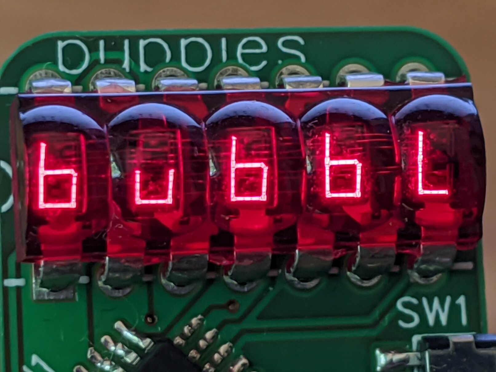
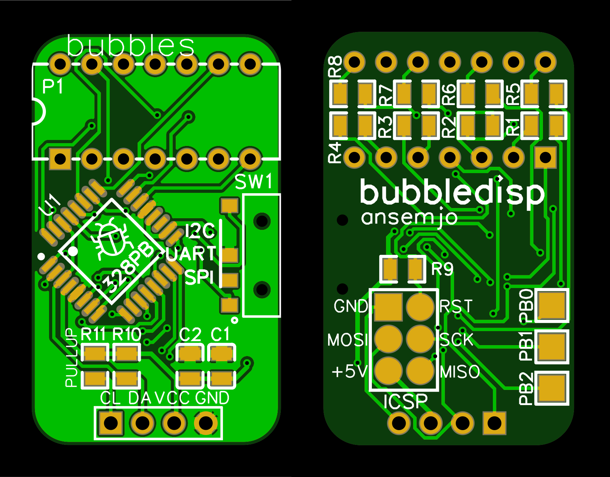
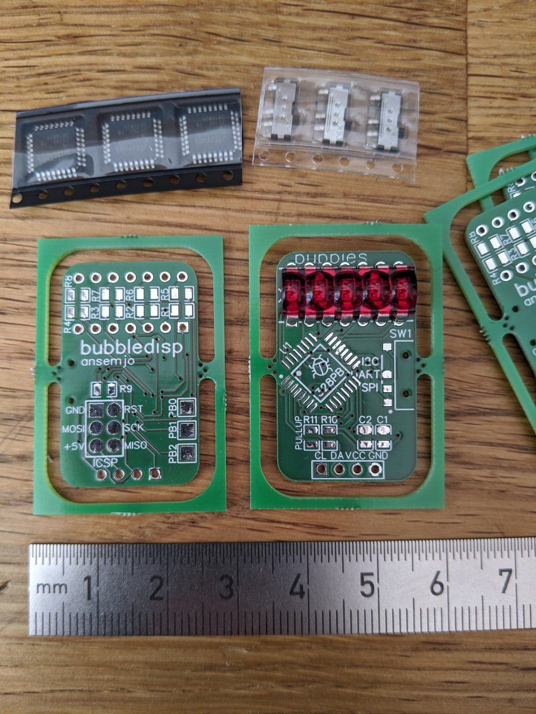
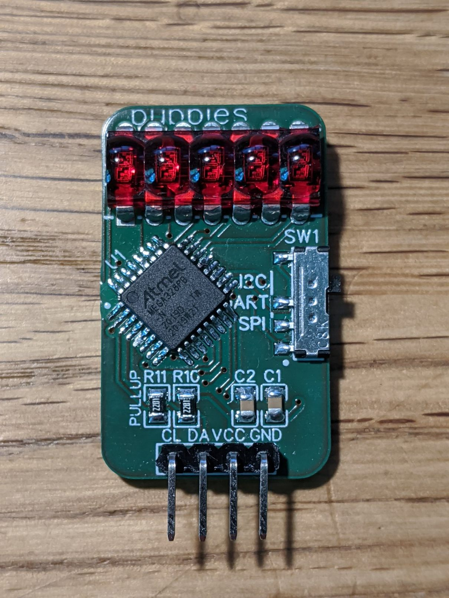
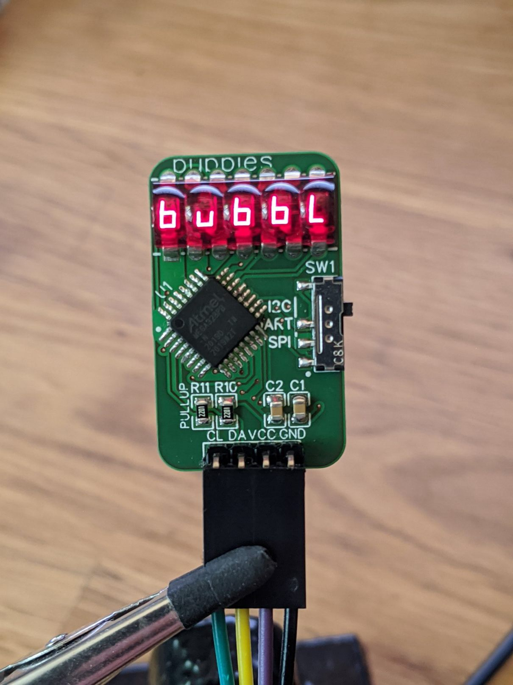

# bubbledisp

This is the project for `bubbledisp`, a small carrier PCB for five-digit
HP bubble displays. In particular I used the HP QDSP-6061 but most datasheets
I've seen for five-digit displays are compatible.



It is the first PCB that I designed myself and manufactured at [AISLER](https://aisler.net/).
After a previous project that I hand-soldered on protoboard – which is not yet
documented anywhere – I wanted to miniaturize the board and have a universal
display, which speaks whatever protocol that suits my needs best.

So this little circuit board is basically that: flip the slider switch on the
right to speak I2C, UART or SPI and connect it in your development environment.

## Hardware

The hardware part is documented in [`hardware`](hardware/). Particularly, you
can find the [schematic](hardware/schematic.pdf) and Gerber files there.
The project was created with EasyEDA online.



The pullups R11 and R10 are optional if you don't want to use I2C or have external
pullups somewhere else. They don't hurt though and UART and SPI both work fine
with pullups, too.

Otherwise, `VCC` is connected directly to the ATmega328PB, so the specifications
from the [datasheet](http://ww1.microchip.com/downloads/en/DeviceDoc/40001906C.pdf)
directly apply: i.e. use 3.3 V or 5 V with appropriate logic levels.

## Software

The firmware still needs some work but all the protocols *kind of* work. The I2C
protocol is the most functional one as of now.

It is a PlatformIO project in [`firmware`](firmware/). First set the fuses and
then flash the firmware:

    pio run -t fuses
    pio run -t program

You may need a pogo-pin adapter to properly make contact with the ICSP pads on
the bottom side.

Select the protocol you wish to use **before** powerup. The switch is only checked
once inside `setup()`.

### I2C

The node address is configured as `I2C_ADDRESS` in `main.ino` and is currently
`0x32` by default. The pinout is as follows:

| Pin | Function |
| --- | -------- |
| GND | Ground   |
| VCC | VCC      |
| DA  | SDA      |
| CL  | SCL      |

Currently only three ports are available for writing:

| Port | Description |
| ---- | ----------- |
| `0x00` | text input, always beginning at leftmost digit |
| `0x01` | raw segment map input, beginning at leftmost digit |
| ------ | |
| `0x12` | set multiplexing rate as `OCR2A` compare value, `1` = fast, `255` = slow |

The text input uses a simple translation map, that can be seen in [`segments.h`](firmware/src/segments.h).
Most of the alphabet, numbers and a few symbols work.

For the raw segment input, refer to this ASCII graphic from `segments.h`:

```
                            a
     Ad╶┐┌╴Ae             ────
    Ac╶┐││┌╴Af         f │    │
   Ab╶┐││││┌╴Ag          │  g │ b
  Aa╶┐││││││┌╴Adp  ❯❯     ────
   0b00000000          e │    │
                         │    │ c
                          ────
                            d   ■ dp
```

For example, using a `i2c-tiny-usb` and the `i2c-tools` on a Linux computer:

| Example | Command |
| ------- | ------- |
| `HELLO` | `i2ctransfer -y 10 w6@0x32 0x00 0x48 0x45 0x4c 0x4c 0x4f` |
| `01234` | `i2ctransfer -y 10 w6@0x32 0x00 0x30+` |
| `EƎ-EƎ` | `i2ctransfer -y 10 w6@0x32 0x01 0x9e 0xf2 0x02 0x9e 0xf2` |
| flicker | `i2cset -y 10 0x32 0x12 0x90`

### UART

The UART mode is configured as `8N1` with 57600 baud. You can try setting
`UART_SPEED` higher but those speeds are not guaranteed to work with the internal
RC oscillator.

| Pin | Function |
| --- | -------- |
| GND | Ground   |
| VCC | VCC      |
| DA  | RX       |
| CL  | TX       |

There is not much happening on `TX` as of yet, so you can use UART with just three
wires. All input is interpreted as text and a newline clears the line and resets
the cursor to the first digit. If more than 5 characters are sent without a newline
the text scrolls off to the left.

| Display | .. after sending |
| -------:|:---------------- |
| `HELLO` | `HELLO` |
| `LO123` | `123`   |
| `     ` | `\n`    |
| `   OK` | `\n···OK`|

### SPI

Beware, here be dragons.

SPI is pretty buggy still because I didn't realize that `SS` is necessary for
proper synchronization. As the hardware SPI will refuse to work when `SS` is not
pulled low, a very crude software implementation is currently used. This however
easily loses sync so that any following input is garbled. Meh'.

For the above reasons there's no documentation yet. Improvements are welcome!

## Pictures

A few more pictures:



